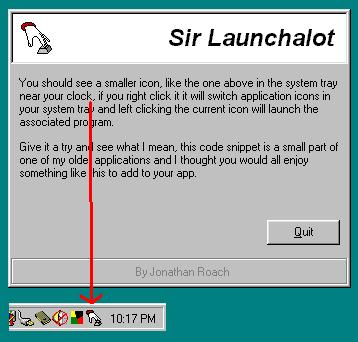

<div align="center">

## Sir Launchalot \- Program Cycling in the Systray


</div>

### Description

This code demonstrates how to cycle programs in your systray for ease of launching, it provides a system tray icon which cycles/changes when right clicked, the associated program can then be launched when the user left clicks the tray icon.
 
### More Info
 
Note, this code has only been tested on a Windows 98 machine and a Windows 2000 machine, other Win OS versions please leave me a comment or email on how it ran or if there were problems and what exactly happened.

Assumes you have the following, otherwise changes need to be made:

Explorer.exe - Windows Explorer

Control.exe - Control Panel

Iexplore.exe - Internet explorer

A default mail client


<span>             |<span>
---                |---
**Submitted On**   |2001-12-22 22:25:58
**By**             |[Jonathan Roach](https://github.com/Planet-Source-Code/PSCIndex/blob/master/ByAuthor/jonathan-roach.md)
**Level**          |Intermediate
**User Rating**    |4.3 (13 globes from 3 users)
**Compatibility**  |VB 5\.0, VB 6\.0
**Category**       |[Miscellaneous](https://github.com/Planet-Source-Code/PSCIndex/blob/master/ByCategory/miscellaneous__1-1.md)
**World**          |[Visual Basic](https://github.com/Planet-Source-Code/PSCIndex/blob/master/ByWorld/visual-basic.md)
**Archive File**   |[Sir\_Launch4365112222001\.zip](https://github.com/Planet-Source-Code/jonathan-roach-sir-launchalot-program-cycling-in-the-systray__1-30052/archive/master.zip)

### API Declarations

```
ShellExecute
SendMessage
```


